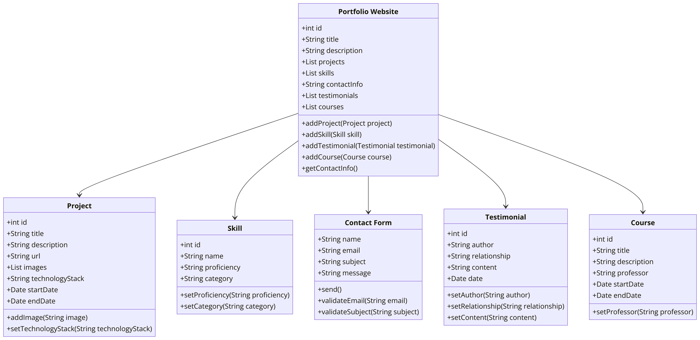

# PROJECT PLANNING AND REQUIREMENT GATHERING

## Objectives
The main goal of this project is to showcase my experience, set of skills, projects, and interests. Additionally, I would like to show how people can reach out to me in case they would like to collaborate or hire me.

## Requirements
1. Laptop / Desktop Computer
2. VS Code
3. Hosting Platform

## Feasibility
Very Feasible

## Scope
- **Home Page**: A brief introduction about myself and a summary of what the site contains.
- **Portfolio Section**: Detailed descriptions of my projects, including screenshots, project links, and possibly video demos and computer science courses that I have worked on.
- **Skills Section**: A breakdown of my technical and soft skills.
- **Testimonials**: Include testimonials from professors, colleagues, or clients if available.
- **Resume/CV**: Option to download your resume or CV.
- **Contact Form**: Besides providing contact information, consider adding a contact form for direct messages.

# PROJECT DESIGN

# System Design:

# User Interface Design:

# Technology Stack: 
React-Js
Next-Js
Javascript
HTML
CSS
NEXT UI
shadcn